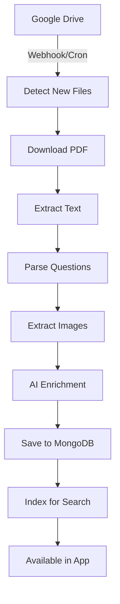

# 🗺️ Mapeamento Completo - Site Prof. Jean Ribeiro

## 📊 Visão Geral do Site

**URL Base**: https://profjeanribeiro.wixsite.com/mentoria  
**Plataforma**: Wix  
**Propósito**: Mentoria educacional para vestibulares

---

## 🏗️ Estrutura de Navegação Mapeada

```
📁 Site Principal
│
├── 🏠 Início
│   └── /mentoria
│
├── 👨‍🏫 Sobre
│   └── /sobre
│
├── 🎓 Mentoria
│   ├── /aulas-e-mentorias
│   └── /beneficios (BENEFÍCIOS)
│
├── 📚 Vestibulares
│   ├── /vestibulares (Hub principal)
│   ├── /enem (ENEM)
│   ├── /uem (UEM)
│   ├── /uepg (UEPG)
│   ├── /unicentro (UNICENTRO)
│   ├── /uel (UEL)
│   ├── /ufpr (UFPR)
│   └── /unioeste (UNIOESTE)
│
├── 🎯 Seriados
│   ├── /seriados (Hub)
│   ├── /pas-uem (PAS - UEM)
│   ├── /pac-unicentro (PAC - UNICENTRO)
│   └── /pss-uepg (PSS - UEPG)
│
├── 📖 Materiais
│   └── /materiais
│
├── 🛠️ Ferramentas
│   ├── /ferramentas
│   └── /marketplace (MarketPlace)
│
└── 🏆 Aprovações
    └── /aprovacoes
```

---

## 📋 Estrutura Detalhada por Vestibular

### Exemplo: UEM (Padrão identificado)

Cada página de vestibular contém:

#### 1. Informações Gerais

- Nome da universidade
- Descrição institucional
- Localização (mapa integrado)
- Site oficial
- Link "Saiba mais"

#### 2. Informações do Próximo Vestibular

- Data da prova
- Período de inscrições
- Site oficial de inscrição
- Valor da taxa
- Status (aberto/encerrado)

#### 3. Links para Google Drive (Recursos)

**Estrutura identificada na UEM:**

| Recurso              | Descrição                         | Link Pattern                               |
| -------------------- | --------------------------------- | ------------------------------------------ |
| **PROVAS**           | Provas e gabaritos anteriores     | `drive.google.com/drive/folders/1YGacJ...` |
| **INFORMAÇÕES**      | Informações sobre o vestibular    | `drive.google.com/drive/folders/1VfR88...` |
| **NOTAS DE CORTE**   | Histórico de notas de corte       | `drive.google.com/drive/folders/1f5Gzq...` |
| **CONCORRÊNCIA**     | Dados de concorrência             | `drive.google.com/drive/folders/1FPSd_...` |
| **LISTAS SOMATÓRIO** | Exercícios tipo somatório (1000+) | `drive.google.com/drive/folders/17I8V...`  |

---

## 🎯 Estratégia de Encapsulamento

### Fase 1: Mapeamento Completo (1-2 semanas)

#### Etapa 1.1: Crawling Estrutural

```typescript
interface PaginaVestibular {
  nome: string;
  url: string;
  descricao: string;
  dataProva?: Date;
  inscricoes?: {
    inicio: Date;
    fim: Date;
    status: "aberto" | "encerrado";
    taxa: number;
  };
  recursos: RecursoVestibular[];
}

interface RecursoVestibular {
  tipo: "provas" | "informacoes" | "notas_corte" | "concorrencia" | "listas";
  titulo: string;
  googleDriveUrl: string;
  descricao: string;
}
```

#### Etapa 1.2: Extração de Dados

- [ ] Mapear todas as 7 universidades
- [ ] Mapear os 3 processos seriados (PAS, PAC, PSS)
- [ ] Extrair todos os links do Google Drive
- [ ] Documentar estrutura de cada pasta do Drive
- [ ] Identificar padrões de organização

#### Etapa 1.3: Catalogação de Recursos

```typescript
const vestibularesMapeados = {
  enem: {
    nome: 'ENEM',
    url: '/enem',
    recursos: [...]
  },
  uem: {
    nome: 'UEM - Universidade Estadual de Maringá',
    url: '/uem',
    recursos: [
      { tipo: 'provas', url: 'drive.google.com/...', arquivos: 150 },
      { tipo: 'informacoes', url: 'drive.google.com/...', arquivos: 20 },
      { tipo: 'notas_corte', url: 'drive.google.com/...', arquivos: 10 },
      { tipo: 'concorrencia', url: 'drive.google.com/...', arquivos: 10 },
      { tipo: 'listas', url: 'drive.google.com/...', arquivos: 1000 }
    ]
  },
  // ... outros vestibulares
};
```

---

### Fase 2: Integração com Google Drive API (2-3 semanas)

#### Etapa 2.1: Configuração Google Drive API

```bash
# Dependências necessárias
yarn add googleapis google-auth-library
```

#### Etapa 2.2: Service de Integração

```typescript
// services/google-drive.service.ts
class GoogleDriveService {
  // Listar arquivos de uma pasta
  async listFiles(folderId: string) {
    // Retorna lista de PDFs da pasta
  }

  // Obter metadados de arquivo
  async getFileMetadata(fileId: string) {
    // Nome, tamanho, data de modificação
  }

  // Download de arquivo (para processamento)
  async downloadFile(fileId: string) {
    // Download do PDF para extração
  }

  // Gerar link de preview
  async getPreviewLink(fileId: string) {
    // Link para visualização no iframe
  }
}
```

#### Etapa 2.3: Modelo de Dados

```typescript
// Coleção: ProvasVestibular
interface ProvaVestibular {
  _id: ObjectId;
  vestibular: string; // 'uem', 'uel', etc
  ano: number;
  tipo: string; // 'primeira_fase', 'segunda_fase'
  googleDriveFileId: string;
  googleDriveFolderId: string;
  nome: string;
  url: string; // URL direto do Google Drive
  previewUrl: string; // URL de preview
  dataUpload: Date;
  tamanhoBytes: number;

  // Metadados extraídos
  materia?: string;
  numeroQuestoes?: number;
  processado: boolean;

  createdAt: Date;
  updatedAt: Date;
}
```

---

### Fase 3: Processamento de Provas (3-4 semanas)

#### Etapa 3.1: Extração de Questões (PDF Processing)

```typescript
// services/pdf-processor.service.ts
class PDFProcessorService {
  async extractQuestions(pdfBuffer: Buffer) {
    // 1. Converter PDF em texto
    const text = await pdfParse(pdfBuffer);

    // 2. Identificar questões (padrões)
    // Exemplo: "1)", "Questão 01", etc

    // 3. Extrair enunciado

    // 4. Extrair alternativas (A, B, C, D, E)

    // 5. Identificar imagens

    return questoesExtraidas;
  }

  async extractWithOCR(pdfBuffer: Buffer) {
    // Caso o PDF seja imagem (scaneado)
    // Usar Tesseract.js ou Google Vision API
  }
}
```

#### Etapa 3.2: IA para Enriquecimento

```typescript
// services/ai-enrichment.service.ts
class AIEnrichmentService {
  async enrichQuestion(questao: string) {
    const prompt = `
      Analise a questão a seguir e retorne:
      - Matéria principal
      - Assunto específico
      - Nível de dificuldade (fácil, médio, difícil)
      - Tags relacionadas
      
      Questão: ${questao}
    `;

    const response = await openai.chat.completions.create({
      model: "gpt-4",
      messages: [{ role: "user", content: prompt }],
    });

    return parseResponse(response);
  }

  async generateExplanation(questao: QuestaoCompleta) {
    // Gerar explicação da resposta correta
  }
}
```

---

### Fase 4: Interface no App (2-3 semanas)

#### Etapa 4.1: Estrutura de Navegação

```
📱 App Principal
│
├── 🏠 Dashboard
│
├── 📚 Vestibulares
│   ├── ENEM
│   ├── UEM
│   ├── UEPG
│   ├── UNICENTRO
│   ├── UEL
│   ├── UFPR
│   └── UNIOESTE
│
└── 🎯 Processos Seriados
    ├── PAS (UEM)
    ├── PAC (UNICENTRO)
    └── PSS (UEPG)
```

#### Etapa 4.2: Telas Principais

**1. Lista de Vestibulares**

```typescript
// pages/vestibulares/ListaVestibulares.tsx
<Grid container spacing={3}>
  {vestibulares.map((vestibular) => (
    <Grid item xs={12} sm={6} md={4}>
      <Card>
        <CardMedia component="img" image={vestibular.logo} />
        <CardContent>
          <Typography variant="h6">{vestibular.nome}</Typography>
          <Typography variant="body2">{vestibular.descricao}</Typography>
        </CardContent>
        <CardActions>
          <Button onClick={() => navigate(`/vestibulares/${vestibular.id}`)}>
            Acessar
          </Button>
        </CardActions>
      </Card>
    </Grid>
  ))}
</Grid>
```

**2. Página de Vestibular Específico**

```typescript
// pages/vestibulares/[id]/DetalhesVestibular.tsx
<Container>
  {/* Header */}
  <Box>
    <Avatar src={vestibular.logo} />
    <Typography variant="h4">{vestibular.nome}</Typography>
    <Typography>{vestibular.descricao}</Typography>
  </Box>

  {/* Informações da Próxima Prova */}
  <Card>
    <CardHeader title="Próximo Vestibular" />
    <CardContent>
      <Typography>Data: {vestibular.dataProva}</Typography>
      <Typography>Inscrições: {vestibular.inscricoes}</Typography>
      <Typography>Taxa: {vestibular.taxa}</Typography>
      <Button href={vestibular.siteOficial}>Inscreva-se</Button>
    </CardContent>
  </Card>

  {/* Recursos Disponíveis */}
  <Grid container spacing={2}>
    <Grid item xs={12} md={6}>
      <Card>
        <CardHeader title="Provas Anteriores" />
        <List>
          {vestibular.provas.map((prova) => (
            <ListItem button onClick={() => openProva(prova)}>
              <ListItemText primary={prova.nome} secondary={prova.ano} />
              <IconButton>
                <DownloadIcon />
              </IconButton>
            </ListItem>
          ))}
        </List>
      </Card>
    </Grid>

    <Grid item xs={12} md={6}>
      <Card>
        <CardHeader title="Notas de Corte" />
        {/* Tabela ou gráfico */}
      </Card>
    </Grid>

    <Grid item xs={12} md={6}>
      <Card>
        <CardHeader title="Concorrência" />
        {/* Estatísticas */}
      </Card>
    </Grid>

    <Grid item xs={12} md={6}>
      <Card>
        <CardHeader title="Informações" />
        {/* Links e documentos */}
      </Card>
    </Grid>
  </Grid>

  {/* Criar Simulado */}
  <Button
    variant="contained"
    size="large"
    onClick={() => navigate(`/simulados/criar?vestibular=${id}`)}
  >
    Criar Simulado Personalizado
  </Button>
</Container>
```

**3. Visualizador de Prova**

```typescript
// components/ProvaViewer.tsx
<Dialog fullScreen open={open}>
  <AppBar>
    <Toolbar>
      <IconButton onClick={onClose}>
        <CloseIcon />
      </IconButton>
      <Typography>{prova.nome}</Typography>
      <Box flexGrow={1} />
      <IconButton onClick={handleDownload}>
        <DownloadIcon />
      </IconButton>
    </Toolbar>
  </AppBar>

  {/* Iframe com preview do Google Drive */}
  <iframe src={prova.previewUrl} width="100%" height="100%" frameBorder="0" />
</Dialog>
```

---

### Fase 5: Geração de Simulados (2-3 semanas)

#### Etapa 5.1: Criação de Simulados Baseados em Provas

```typescript
// pages/simulados/CriarSimulado.tsx
<Stepper activeStep={activeStep}>
  <Step>
    <StepLabel>Selecionar Vestibular</StepLabel>
  </Step>
  <Step>
    <StepLabel>Configurar Simulado</StepLabel>
  </Step>
  <Step>
    <StepLabel>Selecionar Questões</StepLabel>
  </Step>
  <Step>
    <StepLabel>Revisar e Criar</StepLabel>
  </Step>
</Stepper>;

{
  /* Step 1: Selecionar Vestibular */
}
<FormControl fullWidth>
  <InputLabel>Vestibular Base</InputLabel>
  <Select value={vestibular} onChange={handleChange}>
    <MenuItem value="uem">UEM</MenuItem>
    <MenuItem value="uel">UEL</MenuItem>
    {/* ... */}
  </Select>
</FormControl>;

{
  /* Step 2: Configurações */
}
<FormGroup>
  <TextField label="Título do Simulado" value={titulo} />

  <TextField label="Duração (minutos)" type="number" value={duracao} />

  <FormControlLabel
    control={<Checkbox checked={aleatorio} />}
    label="Questões aleatórias"
  />

  <Autocomplete
    multiple
    options={materias}
    renderInput={(params) => <TextField {...params} label="Matérias" />}
  />

  <FormControl>
    <FormLabel>Dificuldade</FormLabel>
    <RadioGroup value={dificuldade}>
      <FormControlLabel value="facil" control={<Radio />} label="Fácil" />
      <FormControlLabel value="medio" control={<Radio />} label="Médio" />
      <FormControlLabel value="dificil" control={<Radio />} label="Difícil" />
      <FormControlLabel value="misto" control={<Radio />} label="Misto" />
    </RadioGroup>
  </FormControl>
</FormGroup>;

{
  /* Step 3: Seleção de Questões */
}
<Box>
  <Typography variant="h6">Selecione as provas de origem</Typography>
  <List>
    {provasDisponiveis.map((prova) => (
      <ListItem>
        <Checkbox
          checked={provasSelecionadas.includes(prova.id)}
          onChange={() => toggleProva(prova.id)}
        />
        <ListItemText
          primary={prova.nome}
          secondary={`${prova.numeroQuestoes} questões`}
        />
      </ListItem>
    ))}
  </List>

  <Typography variant="body2">
    Total de questões disponíveis: {totalQuestoes}
  </Typography>

  <TextField
    label="Quantas questões no simulado?"
    type="number"
    value={quantidadeQuestoes}
    inputProps={{ min: 1, max: totalQuestoes }}
  />
</Box>;

{
  /* Step 4: Revisão */
}
<Card>
  <CardContent>
    <Typography variant="h6">{titulo}</Typography>
    <Typography>Vestibular: {vestibularNome}</Typography>
    <Typography>Duração: {duracao} minutos</Typography>
    <Typography>Questões: {quantidadeQuestoes}</Typography>
    <Typography>Matérias: {materias.join(", ")}</Typography>
    <Typography>Provas base: {provasSelecionadas.length}</Typography>
  </CardContent>
  <CardActions>
    <Button onClick={handleBack}>Voltar</Button>
    <Button variant="contained" onClick={handleCriarSimulado}>
      Criar Simulado
    </Button>
  </CardActions>
</Card>;
```

#### Etapa 5.2: Algoritmo de Seleção de Questões

```typescript
// services/simulado-builder.service.ts
class SimuladoBuilderService {
  async buildSimulado(config: ConfigSimulado) {
    // 1. Buscar questões das provas selecionadas
    const questoesDisponiveis = await this.buscarQuestoes(
      config.vestibular,
      config.provasSelecionadas
    );

    // 2. Filtrar por critérios
    let questoesFiltradas = questoesDisponiveis;

    if (config.materias.length > 0) {
      questoesFiltradas = questoesFiltradas.filter((q) =>
        config.materias.includes(q.materia)
      );
    }

    if (config.dificuldade !== "misto") {
      questoesFiltradas = questoesFiltradas.filter(
        (q) => q.dificuldade === config.dificuldade
      );
    }

    // 3. Selecionar questões
    let questoesSelecionadas: Questao[];

    if (config.aleatorio) {
      // Embaralhar e pegar N questões
      questoesSelecionadas = this.shuffle(questoesFiltradas).slice(
        0,
        config.quantidadeQuestoes
      );
    } else {
      // Pegar as primeiras N
      questoesSelecionadas = questoesFiltradas.slice(
        0,
        config.quantidadeQuestoes
      );
    }

    // 4. Se dificuldade misto, balancear
    if (config.dificuldade === "misto") {
      questoesSelecionadas = this.balancearDificuldade(
        questoesFiltradas,
        config.quantidadeQuestoes
      );
    }

    // 5. Criar simulado
    return await Simulado.create({
      titulo: config.titulo,
      vestibular: config.vestibular,
      duracao: config.duracao,
      questoes: questoesSelecionadas.map((q, idx) => ({
        questaoId: q._id,
        ordem: idx + 1,
        peso: 1,
      })),
      // ... outras configs
    });
  }

  private balancearDificuldade(questoes: Questao[], total: number) {
    const porDificuldade = {
      facil: Math.floor(total * 0.3),
      medio: Math.floor(total * 0.5),
      dificil: Math.floor(total * 0.2),
    };

    const faceis = questoes.filter((q) => q.dificuldade === "facil");
    const medias = questoes.filter((q) => q.dificuldade === "medio");
    const dificeis = questoes.filter((q) => q.dificuldade === "dificil");

    return [
      ...this.shuffle(faceis).slice(0, porDificuldade.facil),
      ...this.shuffle(medias).slice(0, porDificuldade.medio),
      ...this.shuffle(dificeis).slice(0, porDificuldade.dificil),
    ];
  }
}
```

---

## 🔄 Pipeline de Processamento Automático

### Workflow Completo



### Cron Jobs Necessários

```typescript
// jobs/sync-google-drive.job.ts
export class SyncGoogleDriveJob {
  // Executar diariamente às 3h da manhã
  @Cron("0 3 * * *")
  async syncAllFolders() {
    const vestibulares = await Vestibular.find();

    for (const vestibular of vestibulares) {
      await this.syncVestibular(vestibular);
    }
  }

  private async syncVestibular(vestibular: Vestibular) {
    // 1. Listar arquivos da pasta do Drive
    const files = await googleDrive.listFiles(vestibular.driveFolderId);

    // 2. Identificar novos arquivos
    const existingFiles = await ProvaVestibular.find({
      vestibular: vestibular.codigo,
    });

    const newFiles = files.filter(
      (f) => !existingFiles.some((ef) => ef.googleDriveFileId === f.id)
    );

    // 3. Processar novos arquivos
    for (const file of newFiles) {
      await this.processNewProva(vestibular, file);
    }
  }

  private async processNewProva(vestibular: Vestibular, file: DriveFile) {
    // 1. Criar registro da prova
    const prova = await ProvaVestibular.create({
      vestibular: vestibular.codigo,
      googleDriveFileId: file.id,
      nome: file.name,
      url: file.webViewLink,
      processado: false,
    });

    // 2. Adicionar à fila de processamento
    await processamentoQueue.add("process-prova", {
      provaId: prova._id,
    });
  }
}
```

```typescript
// jobs/process-prova.job.ts
export class ProcessProvaJob {
  async process(provaId: ObjectId) {
    const prova = await ProvaVestibular.findById(provaId);

    try {
      // 1. Download do PDF
      const pdfBuffer = await googleDrive.downloadFile(prova.googleDriveFileId);

      // 2. Extrair texto e questões
      const questoesExtraidas = await pdfProcessor.extractQuestions(pdfBuffer);

      // 3. Para cada questão, enriquecer com IA
      for (const questaoRaw of questoesExtraidas) {
        const questaoEnriquecida = await aiService.enrichQuestion(questaoRaw);

        // 4. Salvar questão
        await Questao.create({
          ...questaoEnriquecida,
          origem: {
            tipo: "vestibular",
            vestibular: prova.vestibular,
            prova: prova.nome,
            ano: prova.ano,
            fonte: prova.url,
          },
          provaOrigemId: prova._id,
        });
      }

      // 5. Marcar prova como processada
      await ProvaVestibular.updateOne(
        { _id: provaId },
        {
          processado: true,
          numeroQuestoes: questoesExtraidas.length,
          dataProcessamento: new Date(),
        }
      );
    } catch (error) {
      console.error(`Erro ao processar prova ${provaId}:`, error);

      // Registrar erro para revisão manual
      await ProvaVestibular.updateOne(
        { _id: provaId },
        {
          erroProcessamento: error.message,
          necessitaRevisaoManual: true,
        }
      );
    }
  }
}
```

---

## 📊 Modelo de Dados Estendido

### Coleção: Vestibulares

```typescript
interface Vestibular {
  _id: ObjectId;
  codigo: string; // 'uem', 'uel', etc
  nome: string;
  nomeCompleto: string;
  logoUrl: string;
  descricao: string;
  siteOficial: string;

  // Localização
  cidade: string;
  estado: string;
  coordenadas?: {
    lat: number;
    lng: number;
  };

  // Google Drive
  googleDriveFolders: {
    provas: string; // Folder ID
    informacoes: string;
    notasCorte: string;
    concorrencia: string;
    listas?: string;
  };

  // Próximo vestibular
  proximaProva?: {
    data: Date;
    inscricoes: {
      inicio: Date;
      fim: Date;
    };
    taxa: number;
    siteInscricao: string;
  };

  // Estatísticas
  totalProvasDisponíveis: number;
  totalQuestoesProcessadas: number;
  ultimaSincronizacao: Date;

  ativo: boolean;
  createdAt: Date;
  updatedAt: Date;
}
```

---

## ✅ Checklist de Implementação

### Semana 1-2: Mapeamento

- [ ] Criar scraper para extrair estrutura completa do site
- [ ] Mapear todas as URLs e recursos
- [ ] Documentar padrões identificados
- [ ] Listar todos os links do Google Drive
- [ ] Criar planilha com inventário de recursos

### Semana 3-4: Setup Google Drive

- [ ] Configurar Google Cloud Project
- [ ] Habilitar Google Drive API
- [ ] Criar credenciais OAuth2
- [ ] Implementar service de integração
- [ ] Testar listagem de arquivos
- [ ] Testar download de arquivos

### Semana 5-6: Processamento de PDFs

- [ ] Implementar extração de texto (pdf-parse)
- [ ] Criar parser de questões
- [ ] Implementar OCR (Tesseract.js)
- [ ] Testar com diferentes formatos de prova
- [ ] Validar qualidade de extração

### Semana 7-8: IA e Enriquecimento

- [ ] Integrar OpenAI API
- [ ] Desenvolver prompts de enriquecimento
- [ ] Implementar classificação automática
- [ ] Gerar explicações de questões
- [ ] Validar qualidade das classificações

### Semana 9-10: Interface - Lista

- [ ] Criar página de lista de vestibulares
- [ ] Implementar cards com informações
- [ ] Adicionar filtros e busca
- [ ] Criar página de detalhes do vestibular

### Semana 11-12: Interface - Recursos

- [ ] Implementar visualizador de provas (iframe)
- [ ] Criar lista de recursos por tipo
- [ ] Adicionar download de arquivos
- [ ] Implementar preview de questões
- [ ] Criar componente de notas de corte

### Semana 13-14: Criação de Simulados

- [ ] Desenvolver wizard de criação
- [ ] Implementar algoritmo de seleção
- [ ] Criar preview do simulado
- [ ] Testar balanceamento de dificuldade
- [ ] Validar com dados reais

### Semana 15-16: Automação

- [ ] Configurar cron jobs
- [ ] Implementar fila de processamento
- [ ] Criar dashboard de monitoramento
- [ ] Testar sincronização automática
- [ ] Documentar processo

---

## 🎯 Métricas de Sucesso

| Métrica                       | Meta        |
| ----------------------------- | ----------- |
| **Provas Mapeadas**           | 100+        |
| **Questões Extraídas**        | 10.000+     |
| **Taxa de Sucesso Extração**  | >90%        |
| **Vestibulares Integrados**   | 7 (todos)   |
| **Processos Seriados**        | 3 (todos)   |
| **Tempo Médio Processamento** | <5min/prova |
| **Acurácia IA Classificação** | >85%        |

---

## 📝 Observações Importantes

1. **Direitos Autorais**: As provas são públicas e disponibilizadas pelas próprias universidades
2. **Google Drive**: Precisará de permissão para acessar as pastas compartilhadas
3. **Rate Limits**: Google Drive API tem limites de requisições
4. **Storage**: PDFs podem ocup

---

# ============================================

# SETUP INICIAL - PLATAFORMA DE SIMULADOS IA

# ============================================

# 1. Criar estrutura do projeto (monorepo)

mkdir plataforma-simulados
cd plataforma-simulados

# 2. Inicializar projeto base com Yarn

yarn init -y

# 3. Criar estrutura de pastas

mkdir -p apps/web apps/api packages/shared docs

# ============================================

# FRONTEND (React + Vite + TypeScript)

# ============================================

cd apps/web

# Criar projeto Vite com React + TypeScript

yarn create vite . --template react-ts

# Instalar dependências principais

yarn install

# Instalar dependências adicionais para autenticação e UI

yarn add react-router-dom axios
yarn add @tanstack/react-query zustand
yarn add jwt-decode

# Instalar dependências de desenvolvimento

yarn add -D @types/node

# Material-UI (Sistema de Design)

yarn add @mui/material @emotion/react @emotion/styled
yarn add @mui/icons-material
yarn add @mui/x-data-grid
yarn add @mui/x-date-pickers
yarn add dayjs

# Voltar para raiz

cd ../..

# ============================================

# BACKEND (Node.js + TypeScript + Express)

# ============================================

cd apps/api

# Inicializar projeto Node

yarn init -y

# Instalar dependências principais

yarn add express cors dotenv
yarn add mongoose
yarn add jsonwebtoken bcryptjs
yarn add express-validator

# Google Drive API

yarn add googleapis google-auth-library

# PDF Processing

yarn add pdf-parse tesseract.js

# Instalar dependências de desenvolvimento

yarn add -D typescript @types/node @types/express
yarn add -D @types/cors @types/jsonwebtoken @types/bcryptjs
yarn add -D ts-node-dev nodemon

# Inicializar TypeScript

npx tsc --init

# Voltar para raiz

cd ../..

# ============================================

# SHARED (Tipos compartilhados) feito

# ============================================

cd packages/shared

# Inicializar projeto

yarn init -y

# Instalar TypeScript

yarn add -D typescript

# Inicializar TypeScript

yarn tsc --init

# Voltar para raiz

cd ../..

# ============================================

# CONFIGURAÇÕES ADICIONAIS

# ============================================

# Criar arquivos de configuração na raiz

# .gitignore

.
cat > .gitignore << 'EOF'

# Dependencies

node_modules/
.pnp
.pnp.js

# Testing

coverage/

# Production

build/
dist/

# Environment

.env
.env.local
.env.development.local
.env.test.local
.env.production.local

# Logs

npm-debug.log*
yarn-debug.log*
yarn-error.log*
lerna-debug.log*
.pnpm-debug.log\*

# Editor

.vscode/
.idea/
_.swp
_.swo
\*~

# OS

.DS_Store
Thumbs.db

# Misc

.cache/
.temp/
EOF

# package.json na raiz (workspaces)

cat > package.json << 'EOF'
{
"name": "plataforma-simulados",
"version": "1.0.0",
"private": true,
"workspaces": [
"apps/*",
"packages/*"
],
"scripts": {
"dev:web": "npm run dev --workspace=apps/web",
"dev:api": "npm run dev --workspace=apps/api",
"dev": "concurrently \"npm run dev:api\" \"npm run dev:web\"",
"build:web": "npm run build --workspace=apps/web",
"build:api": "npm run build --workspace=apps/api"
},
"devDependencies": {
"concurrently": "^8.2.2"
}
}
EOF

# Instalar concurrently para rodar frontend e backend juntos

yarn add -D concurrently

# ============================================

# ESTRUTURA DE PASTAS DETALHADA

# ============================================

# Frontend

cd apps/web
mkdir -p src/pages/admin src/pages/escola src/pages/aluno
mkdir -p src/components/ui src/components/layout
mkdir -p src/contexts src/hooks src/services src/types src/utils
mkdir -p src/assets/images src/assets/icons

# Backend

cd ../api
mkdir -p src/controllers src/models src/routes
mkdir -p src/middlewares src/services/auth src/services/ia
mkdir -p src/utils src/config
mkdir -p tests

cd ../..

# ============================================

# ARQUIVOS DE CONFIGURAÇÃO

# ============================================

# Backend - tsconfig.json

cat > apps/api/tsconfig.json << 'EOF'
{
"compilerOptions": {
"target": "ES2020",
"module": "commonjs",
"lib": ["ES2020"],
"outDir": "./dist",
"rootDir": "./src",
"strict": true,
"esModuleInterop": true,
"skipLibCheck": true,
"forceConsistentCasingInFileNames": true,
"resolveJsonModule": true,
"moduleResolution": "node",
"types": ["node"]
},
"include": ["src/**/*"],
"exclude": ["node_modules", "dist"]
}
EOF

# Backend - package.json scripts

cd apps/api
yarn set-script dev "ts-node-dev --respawn --transpile-only src/server.ts"
yarn set-script build "tsc"
yarn set-script start "node dist/server.js"

# Frontend - criar arquivo de variáveis de ambiente

cd ../web
cat > .env.development << 'EOF'
VITE_API_URL=http://localhost:3000
EOF

cd ../..

# ============================================

# MENSAGEM FINAL

# ============================================

echo ""
echo "✅ Projeto configurado com sucesso!"
echo ""
echo "📁 Estrutura criada:"
echo " - apps/web (Frontend React + Vite + TS + Material-UI)"
echo " - apps/api (Backend Node + Express + TS)"
echo " - packages/shared (Tipos compartilhados)"
echo ""
echo "🎨 Material-UI instalado com:"
echo " - @mui/material (componentes principais)"
echo " - @mui/icons-material (ícones)"
echo " - @mui/x-data-grid (tabelas avançadas)"
echo " - @mui/x-date-pickers (seleção de datas)"
echo ""
echo "🚀 Próximos passos:"
echo " 1. Configure o MongoDB e adicione a URI em apps/api/.env"
echo " 2. Configure Google Drive API credentials"
echo " 3. Rode 'yarn dev' na raiz para iniciar frontend e backend"
echo " 4. Acesse http://localhost:5173 (frontend)"
echo " 5. API estará em http://localhost:3000"
echo ""
echo "📝 Documentação completa em: docs/"
echo ""
